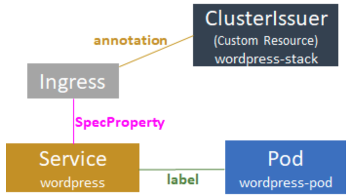

## KubePlus - Tooling for Kubernetes native Application Stacks

Kubernetes native stacks are built by extending Kubernetes Resource set (APIs) with Operators and their Custom Resources. Application workflows on Kubernetes are realized by establishing connections between Kubernetes Resources (APIs). These connections can be based on various relationships such as labels, annotations, ownership, etc.


KubePlus tooling simplifies building, visualizing and monitoring these application workflows. KubePlus is being developed as part of our [Platform as Code practice](https://cloudark.io/platform-as-code).

## Summary

KubePlus tooling consists of - kubectl plugins, CRD annotations and (optional) cluster-side add-on.

### CRD Annotations

In Kubernetes application workflows are built by establishing relationships between Kubernetes built-in and/or Custom Resources. (e.g. a Service is connected to a Pod through labels.) When working with Custom Resources introduced by Operators, it is important that Operator developer's assumptions around what relationships can be established with a Custom Resource and what actions will be performed as a result of them are clearly articulated. KubePlus provides following annotations on Custom Resource Definitions to encode such assumptions.

```
resource/usage
resource/composition
resource/annotation-relationship
resource/label-relationship
resource/specproperty-relationship
```

More details on how to use these annotations can be found [here](./details.rst))

### Client-side kubectl plugins

KubePlus leverages knowledge of relationships between Kubernetes built-in resources and combines that with the CRD annotations mentioned above and builds Kubernetes resource relationship graphs. KubePlus offers a variety of kubectl plugins that internally leverage this graph and enable teams to visualize and monitor application workflows.

### Cluster-side add-on (optional)

KubePlus also provides an optional PlatformWorkflow Operator that further helps teams define application workflows that are hard to realize using just helm charts.

## KubePlus kubectl commands

KubePlus offers following kubectl commands (as kubectl plugins)

**1. kubectl man**

- ``kubectl man cr ``: Provides information about how to use a Custom Resource.

**2. kubectl composition**

- ``kubectl composition cr``: Provides information about sub resources created for a Custom Resource instance.

**3. kubectl connections**

- ``kubectl connections cr``: Provides information about relationships of a Custom Resource instance with other resources (custom or built-in) via labels / annotations / spec properties.
- ``kubectl connections service``: Shows all the Pod and Service resources that can be reached from the given service through labels, annotations, or spec properties. 
- ``kubectl connections pod``: Shows all the Service and Pod resources that can be reached from the given pod through labels, annotations, or spec properties.

**4. kubectl metrics**

- ``kubectl metrics cr``: Provides metrics for a Custom Resource instance (count of sub-resources, pods, containers, nodes, total CPU and total Memory consumption).
- ``kubectl metrics service``: Provides CPU/Memory metrics for all the Pods that are descendants of a Service instance. 
- ``kubectl metrics account``: Provides metrics for an account identity - user / service account. (counts of custom resources, built-in workload objects, pods, total CPU and Memory). Needs cluster-side component.
- ``kubectl metrics helmrelease``: Provides CPU/Memory metrics for all the Pods that are part of a Helm release.

**5. kubectl grouplogs**

- ``kubectl grouplogs cr``: Provides logs for all the containers of a Custom Resource instance.
- ``kubectl grouplogs service``: Provides logs for all the containers of all the Pods that are related to a Service object.
- ``kubectl grouplogs helmrelease`` (upcoming): Provides logs for all the containers of all the Pods that are part of a Helm release.


## Example



``` 
$ kubectl connections service wordpress namespace1

::Final connections graph::
------ Branch 1 ------
Level:0 Service/wordpress
Level:1 Pod/wordpress-pod [related to Service/wordpress by:label]
------ Branch 2 ------
Level:0 Service/wordpress
Level:1 Ingress/wordpress-ingress [related to Service/wordpress by:specproperty]
Level:2 ClusterIssuer/wordpress-stack [related to Ingress/wordpress-ingress by:annotation]


$ kubectl metrics cr MysqlCluster cluster1 namespace1
---------------------------------------------------------- 
 Creator Account Identity: devdattakulkarni@gmail.com
---------------------------------------------------------- 
 Number of Sub-resources: 7
 Number of Pods: 2
 Number of Containers: 16
 Number of Nodes: 1
Total CPU(cores): 84m
Total MEMORY(bytes): 302Mi
----------------------------------------------------------
```

## Try it:

- To obtain metrics, enable Kubernetes Metrics API Server on your cluster.
  - Hosted Kubernetes solutions like GKE has this already installed.

- KubePlus kubectl commands:

```
   $ wget https://github.com/cloud-ark/kubeplus/raw/master/kubeplus-kubectl-plugins-1.0.0.tar.gz
   $ gunzip kubeplus-kubectl-plugins-1.0.0.tar.gz
   $ tar -xvf kubeplus-kubectl-plugins-1.0.0.tar
   $ export KUBEPLUS_HOME=`pwd`
   $ export PATH=$KUBEPLUS_HOME/plugins/:$PATH
   $ kubectl kubeplus commands
```

- Cluster-side component:

```
   $ git clone https://github.com/cloud-ark/kubeplus.git
   $ cd kubeplus
```
- KubePlus kubectl commands:
  - ```$ export KUBEPLUS_HOME=<Full path where kubeplus is cloned>```
  - ```$ export PATH=$KUBEPLUS_HOME/plugins/:$PATH```
- KubePlus Cluster-side component:
  - ```$ ./scripts/deploy-kubeplus.sh```
  - Check out [examples](./examples/moodle-with-presslabs/).

## Operator Maturity Model

In order to build Kubernetes application workflows using Operators and Custom Resources, it is important for Cluster administrators to evaluate different Operators against a standard set of requirements. We have developed [Operator Maturity Model](https://github.com/cloud-ark/kubeplus/blob/master/Guidelines.md) towards this focusing on Operator usage in multi-Operator environments. We use this model when curating community Operators for enterprise readiness. 


## Status

Actively under development

